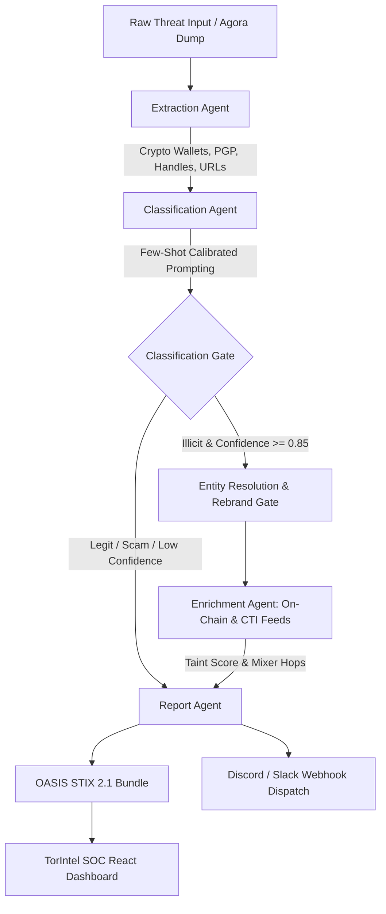

# TorIntel — AI Darknet Entity Resolution & Threat Intelligence Platform

[](https://oasis-open.github.io/cti-documentation/)
[](https://github.com/langchain-ai/langgraph)
[](https://ollama.com/)
[](https://react.dev/)
[](LICENSE)

**TorIntel** is an enterprise-grade, agentic Cyber Threat Intelligence (CTI) and darknet entity resolution platform. Built with **LangGraph**, **Ollama**, and **OASIS STIX 2.1**, TorIntel ingests unstructured threat data from historical darknet marketplace dumps (such as Agora, Bohemia, and Hydra), Telegram channels, and raw intelligence feeds. It autonomously extracts cryptographic indicators, classifies threat severity, detects cross-platform vendor rebrands, executes on-chain cryptocurrency forensics, and delivers interactive intelligence dashboards alongside automated webhook alerts.

---

## 🔒 Responsible CTI Policy
> **Strict Constraint:** This tool is designed exclusively for defense, law enforcement investigations, and threat intelligence operations. It operates strictly on public, historical, or synthetic labeled datasets. No live darknet/Tor scraping or illicit channels are targeted.

---

## 🌟 Key Features

### 1. 🧠 Autonomous Multi-Agent LangGraph Pipeline
- **Extraction Agent:** Deterministic regex pattern matching combined with Ollama JSON Schema structured extraction for cryptocurrency wallets (BTC, XMR, ETH, USDT), 4096-bit PGP key fingerprints, onion mirrors, and communication handles (Telegram, Session, Matrix).
- **Classification Agent:** Few-shot calibrated LLM prompting that categorizes threats into `Illicit`, `Scam`, or `Legit`, calculates confidence scores (0.00–1.00), and generates legal-grade reasoning.
- **Entity Resolution & Rebrand Gate:** Cryptographic key and wallet fingerprint matching to correlate threat actors who rebrand across marketplace takedowns and migrations.
- **Enrichment Agent:** Blockchain heuristics (taint analysis, multi-hop mixer detection across Wasabi/Tornado pools, high-velocity turnover analysis, sanction proximity) and external CTI feed cross-referencing.
- **Report & Dispatch Agent:** Generates OASIS STIX 2.1 compliant JSON bundles and dispatches formatted real-time Discord/Slack incident alerts.

### 2. 🖥️ Modern High-Performance SOC Dashboard
- **Threat Stream & Triage Table:** Live stream of analyzed listings with category badges, vendor aliases, confidence bars, threat score meters, and status badges (`REBRAND IDENTIFIED`, `ILLICIT`, `SCAM`, `LEGIT`).
- **Interactive Quick Filters:** Instantly filter intelligence by `All Listings`, `Rebrand Alerts`, `Illicit Threats`, `Scam Listings`, or `PGP Verified`.
- **Criminal Network Graph Explorer:** Dynamic SVG node-edge graph exposing relationships between darknet vendors, rebrand aliases, PGP fingerprints, cryptocurrency deposit wallets, communication handles, and platform migrations.
- **Trafficking Trends & Intelligence Analytics:** Interactive charts powered by Recharts covering category distribution, cryptocurrency payment preferences, ingestion velocity over time, and operational risk metrics.
- **Autonomous Multi-Agent Pipeline Simulator:** Visual step-by-step LangGraph DAG execution tracer with live token generation, step-level diagnostics, and exportable terminal execution logs (`torintel-agent-terminal: ~ langgraph.log`).
- **OASIS STIX 2.1 Threat Intelligence Hub:** Full STIX 2.1 bundle inspection, interactive object linkage tree (`Identity`, `ThreatActor`, `Indicator`, `Relationship`), JSON syntax viewer, and 1-click bundle downloads.
- **Slide-Over Investigation Dossier Drawer:** Deep-dive suspect dossier with AI Copilot executive summaries, priority law enforcement recommendations (Urgent/High), cross-platform linked aliases, on-chain taint telemetry, and raw text analysis.
- **4 Curated Professional SOC Themes:** Linear Dark, Vercel Clean, Tactical Green, and Cobalt Blue with instant switching and persistent `localStorage` support.
- **Ergonomic Keyboard Shortcuts:** `[` to toggle sidebar, `/` to focus global search, `Esc` to close investigation drawer.

---

## 🏗 System Architecture



---

## 📁 Repository Structure

```
KnightsOfRealm/
├── chd-police-knights/
│   ├── data/                   # Historical sample listings & datasets
│   │   ├── Agora.csv           # Agora Marketplace historical dump
│   │   └── sample_listings.json# Curated test listings
│   ├── frontend/               # React 19 + TypeScript + Vite SOC Dashboard
│   │   ├── src/
│   │   │   ├── components/     # Stream, NetworkGraph, STIXHub, Simulator, Drawer, etc.
│   │   │   ├── context/        # Theme & Application State Providers
│   │   │   ├── data/           # Mock data & initial intelligence feeds
│   │   │   ├── types/          # CTI & STIX 2.1 TypeScript definitions
│   │   │   └── App.tsx         # Main Dashboard Layout
│   │   └── package.json
│   ├── output/                 # Generated OASIS STIX 2.1 JSON Bundles
│   ├── src/                    # Backend Multi-Agent Python Engine
│   │   ├── agents/             # LangGraph Agents (Extractor, Classifier, Enricher, Reporter)
│   │   ├── models/             # Pydantic Schemas & STIX 2.1 Types
│   │   ├── cli.py              # Rich Terminal CLI Interface
│   │   ├── config.py           # Configuration & Environment Variables
│   │   ├── ingestion.py        # Agora & JSON Dataset Ingestion
│   │   └── pipeline.py         # LangGraph StateGraph Definition
│   ├── .env.example
│   ├── requirements.txt
│   └── README.md
```

---

## 🚀 Quick Start Guide

### 1. Prerequisites
- **Python 3.10+**
- **Node.js 18+ & npm**
- **[Ollama](https://ollama.com/)** running locally:
  ```bash
  ollama run qwen2.5:7b
  ```

---

### 2. Backend Installation & Setup

```bash
cd chd-police-knights

# Create and activate Python virtual environment
python -m venv .venv
source .venv/bin/activate   # On Windows: .venv\Scripts\activate

# Install backend dependencies
pip install -r requirements.txt

# Configure environment variables
cp .env.example .env
```

#### Key `.env` Configuration Options:
```env
OLLAMA_BASE_URL=http://localhost:11434
OLLAMA_MODEL=qwen2.5:7b
CONFIDENCE_THRESHOLD=0.85
ALERT_WEBHOOK_URL=https://discord.com/api/webhooks/... # Optional
LOG_LEVEL=INFO
```

---

### 3. Running Backend Pipeline & CLI

#### Ingest directly from Agora Marketplace Dump (`Agora.csv`):
```bash
# Ingest 5 hacking listings from Agora
python -m src.cli --agora --agora-category "Services/Hacking" --limit 5

# Ingest and search for keyword
python -m src.cli --agora --agora-query "bitcoin" --limit 3
```

#### Run on Curated Sample Dataset:
```bash
python -m src.cli --sample
```

#### Run on a Custom File:
```bash
python -m src.cli --file path/to/listings.json
```

#### Analyze a Raw Text Snippet:
```bash
python -m src.cli --text "Vendor: ShadowX. Selling enterprise DB dumps for 0.5 BTC: 1A1zP1eP5QGefi2DMPTfTL5SLmv7DivfNa"
```

---

### 4. Running the TorIntel SOC Frontend

```bash
cd chd-police-knights/frontend

# Install frontend dependencies
npm install

# Start the Vite development server
npm run dev
```

Open your browser at `http://localhost:5173` to explore the **TorIntel SOC Dashboard**.

To build for production:
```bash
npm run build
```

---

## 📊 Output Artifacts & STIX 2.1 Compliance

OASIS STIX 2.1 threat intelligence bundles are automatically generated and saved under `output/`:
- `output/stix_<LISTING_ID>.json`

Each bundle contains OASIS STIX 2.1 objects:
- `Identity`: TorIntel reporting engine metadata.
- `ThreatActor`: Extracted vendor aliases, threat categorization, and identity cluster tags.
- `Indicator`: Flagged cryptocurrency wallets, onion mirrors, and PGP fingerprints with STIX pattern expressions.
- `Relationship`: Graph linkages connecting indicators to threat actors (`indicates`, `attributed-to`).

---

## 🎨 Theme System

TorIntel includes 4 built-in dark themes:
- **Linear Dark** *(Default)*: Deep slate background with vibrant indigo accents.
- **Vercel Clean**: Pure monochrome black-and-white minimalist layout.
- **Tactical Green**: Cyberpunk terminal aesthetic with high-contrast emerald accents.
- **Cobalt Blue**: Deep navy palette with electric cyan accents.

---

## 🛡️ License & Acknowledgments

TorIntel is developed under the Apache 2.0 License. Built for ethical threat intelligence, defense operations, and cybersecurity research.
